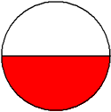

# Fractions
https://stackhouseclass.github.io/FractionsDisplay/

A circle is a geometric shape that we have seen in other lessons. The circle to the left can be used to represent one whole. We can divide this circle into equal parts as shown below.

***
This circle has been divided into 2 equal parts. 

***

This circle has been divided into 3 equal parts. 

***

This circle has been divided into 4 equal parts. 

***

We can shade a portion of a circle to name a specfic part of the whole as shown below

The shaded portion is 1/2 of the whole circle.

***

The shaded portion of the whole circle is 2/3 of the whole circle. 

***

The shaded portion os 1/4 of the whole circle. 

***
The Numbers 1/2, 1/3, and 1/4 are called fractions. 

Definition: A **fraction** names part of a region or part of a group. The top number of a fraction is called its **numerator** and the bottom part is its **denominator**.

So a fraction is the number of shaded parts divided by the number of equal parts as shown below.

   **__number of shaded parts**__ numerator --> make a paint image to display this instead 
   
   **number of equal parts**  denominator
   
   # lesson taken from https://www.mathgoodies.com/lessons/fractions 
   
  
